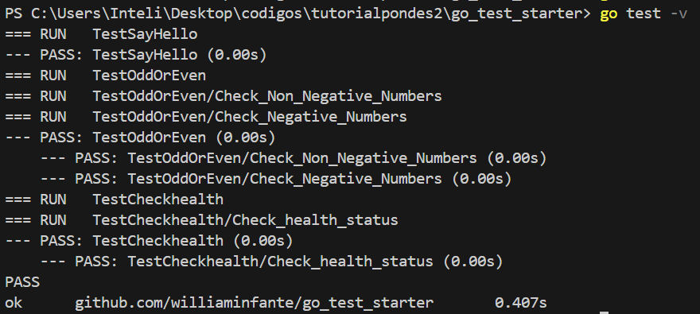
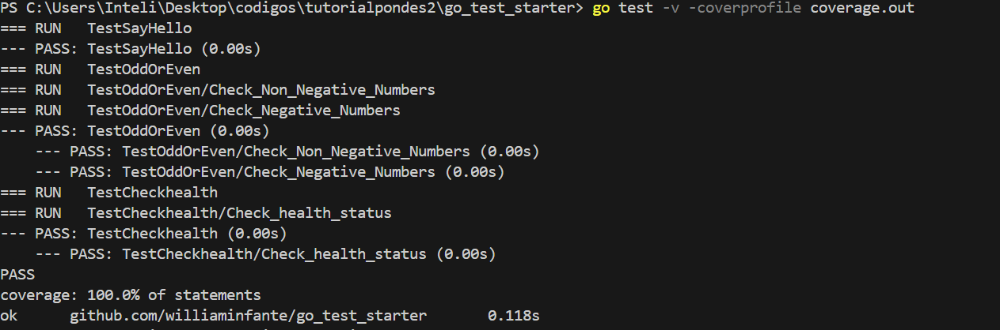
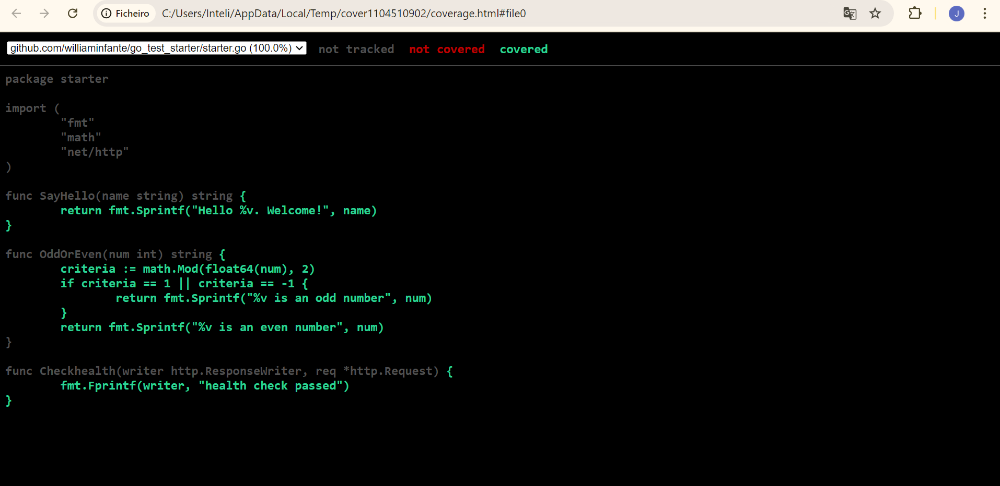

# TDD em GoLang

## Testes em Go

Em Go, os testes são uma parte crucial do desenvolvimento de software de alta qualidade. A linguagem suporta testes automatizados diretamente com sua ferramenta de teste embutida, que permite aos desenvolvedores escrever, executar e verificar testes com facilidade. Para organizar os testes, geralmente criamos arquivos de teste com o sufixo _test.go e utilizamos pacotes como testing e bibliotecas como testify para facilitar a escrita de testes.

## Desenvolvimento Orientado a Testes (TDD)

O TDD é uma abordagem de desenvolvimento de software onde os testes são escritos antes do código funcional. Este processo envolve três etapas principais:

Red (Vermelho): Escrever um teste que falhe inicialmente, pois a funcionalidade ainda não foi implementada.
Green (Verde): Escrever o código mínimo necessário para fazer o teste passar.
Refactor (Refatorar): Melhorar o código garantindo que os testes continuem passando.

## Aplicação do TDD em Go

Aplicar TDD em Go envolve criar funções de teste que verificam se o código atende aos requisitos especificados. Vamos passar pelo ciclo TDD (Red, Green, Refactor) para criar uma função SayHello(name string) string que retorna uma saudação personalizada.

### Red: Escrever um teste que falhe
Primeiro, escrevemos um teste que esperamos que falhe, pois a função SayHello ainda não foi implementada.

```
package starter_test

import (
  "testing"

  "github.com/stretchr/testify/assert"
  starter "github.com/williaminfante/go_test_starter"
)

func TestSayHello(t *testing.T) {
  greeting := starter.SayHello("William")
  assert.Equal(t, "Hello William. Welcome!", greeting)
}
```


Quando rodamos go test -v, veremos que o teste falha, pois a função SayHello não existe ainda.

### Green: Implementar o código mínimo para passar no teste

Agora, implementamos a função SayHello no arquivo starter.go:

```
package starter

func SayHello(name string) string {
    return "Hello " + name + ". Welcome!"
}
```

Rode novamente o teste com go test -v. Desta vez, o teste deve passar, indicando que a implementação mínima está correta.

### Refactor: Melhorar o código mantendo os testes passando

Com o teste passando, podemos refatorar o código se necessário. No nosso exemplo, o código já está simples e claro, então não há necessidade de refatoração adicional. No entanto, se tivéssemos lógica complexa, poderíamos refatorar para melhorar a legibilidade e manutenção.

## Execuções dos testes

### Rodar testes executando go test -v

Executando o comando go test -v, você pode ver a saída detalhada dos testes, incluindo quais testes foram executados e seus resultados.




### Rodar testes e verificar o cover deles executando go test coverage.out

Executando o comando go test -coverprofile=coverage.out, você pode gerar um arquivo coverage.out que contém informações sobre a cobertura dos testes.





### Rodar testes e gerar um html do cover deles executando go test coverage.out

Executando o comando go tool cover -html=coverage.out -o coverage.html, você pode gerar um relatório de cobertura em formato HTML a partir do arquivo coverage.out.




## Conclusão

Seguindo o ciclo TDD (Red, Green, Refactor), garantimos que cada nova funcionalidade é bem testada e que o código é continuamente melhorado para manter a qualidade e legibilidade. Essa prática ajuda a prevenir bugs e facilita a manutenção e evolução do software.


